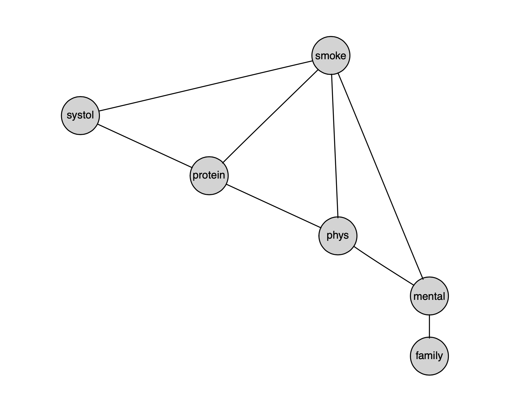
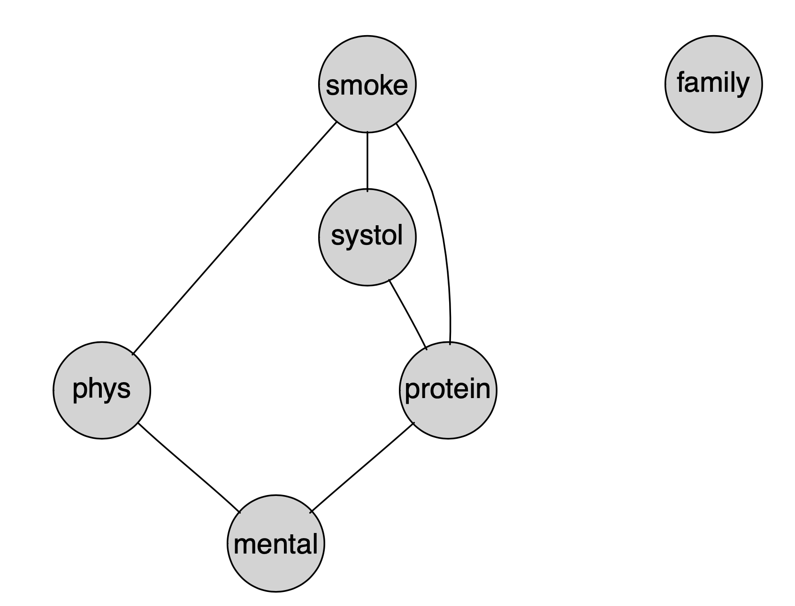
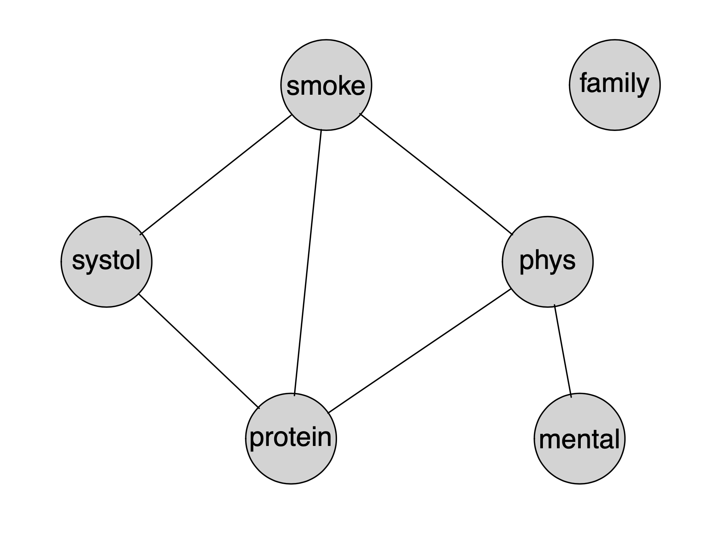

---
### Reinis Data Analysis
##### Heather Shen
##### 12/10/2020
---

```{r setup, include=FALSE}
knitr::opts_chunk$set(echo = TRUE)
```
Reading in the dataset
```{r, echo = FALSE, error=FALSE, include = FALSE}
library(gRbase)
library(gRim)
data(reinis)
str(reinis)
```

### 

We have in our dataset:

* A indicates whether or not the worker “smokes”
* B corresponds to “strenuous mental work”
* C corresponds to “strenuous physical work”
* D corresponds to “systolic blood pressure”
* E corresponds to “ratio of $\beta$ and $\alpha$ lipoproteins”
* F represents “family anamnesis of coronary heart disease” 

Using the backwards stepwise function on this dataset with the AIC criterion, the resulting model is:

```{r, echo = FALSE}
## Backwards stepwise function with AIC
# dev.off()
m.init <- dmod(~.^., data=reinis)
m.reinis <- stepwise(m.init, details = 1)
plot(m.reinis)
```



We see that in the stepwise function, each step takes out an edge that decreases AIC the most until there are no more edges that decrease AIC. Thus, each of the models output by the stepwise function was a part of the process of choosing the final model. So our relevant models begin with the saturated model and the steps were:

* (BD)^{-}
* (BD, CD)^{-}
* (BD, CD, BE)^{-}
* (BD, CD, BE, DF)^{-}
* (BD, CD, BE, DF, EF)^{-}
* (BD, CD, BE, DF, EF, CF)^{-}
* (BD, CD, BE, DF, EF, CF, AF)^{-}

```{r, eval = FALSE}
## Start with the saturated model
m.init <- dmod(~.^., data=reinis)

## Step 1
testdelete(m.init, ~smoke:mental)
testdelete(m.init, ~smoke:phys)
testdelete(m.init, ~smoke:systol)
testdelete(m.init, ~smoke:protein)
testdelete(m.init, ~smoke:family)

testdelete(m.init, ~mental:phys)
testdelete(m.init, ~mental:systol)
testdelete(m.init, ~mental:protein)
testdelete(m.init, ~mental:family)

testdelete(m.init, ~phys:systol)
testdelete(m.init, ~phys:protein)
testdelete(m.init, ~phys:family)

testdelete(m.init, ~systol:protein)
testdelete(m.init, ~systol:family)

testdelete(m.init, ~protein:family)

## Step 2
comparemodels <- function(m1,m2) {
  lrt <- m2$fitinfo$dev - m1$fitinfo$dev
  dfdiff <- m1$fitinfo$dimension[1] - m2$fitinfo$dimension[1]
  c('lrt'=lrt, 'df'=dfdiff)
}

m.2 <- dmod(~smoke:phys + smoke:systol + smoke:protein + mental:phys + systol:protein, data=reinis, details = 1)
1 - pchisq(m.2$fitinfo$dev, m.2$fitinfo$dimension[1])

## Step 3
testadd(m.2, ~smoke:mental, details = 1)
# testadd(m.2, ~smoke:family, details = 1)
testadd(m.2, ~mental:systol, details = 1)
testadd(m.2, ~mental:protein, details = 1) #*
# testadd(m.2, ~mental:family, details = 1)
testadd(m.2, ~phys:systol, details = 1)
testadd(m.2, ~phys:protein, details = 1) #*
# testadd(m.2, ~phys:family, details = 1)
# testadd(m.2, ~systol:protein, details = 1)
# testadd(m.2, ~systol:family, details = 1)

m.3.1 = dmod(~smoke:phys + smoke:systol + smoke:protein + mental:phys + systol:protein + mental:protein + family, data=reinis, details = 1)
m.3.2 = dmod(~smoke:phys + smoke:systol + smoke:protein + mental:phys + systol:protein + phys:protein + family, data=reinis, details = 1)
## Step 4
m.4.1 <- update(m.3.1, list(dedge= ~ mental:protein + phys:protein))
m.4.2 <- update(m.3.2, list(dedge= ~ mental:protein + phys:protein))
1 - pchisq(m.4.1$fitinfo$dev, m.4.1$fitinfo$dimension[1])
1 - pchisq(m.4.2$fitinfo$dev, m.4.2$fitinfo$dimension[1])
```

Taking the saturated model with these (BD, CD, BE, DF, EF, CF, AF) edges deleted gives us our final model: [AB, AC, AE, AD, BF, BC, CE, DE]

The motivation for AIC is that, under suitable assumptions, it is an approximate measure of the expected Kullback–Leibler distance between the true distribution and the
estimated. 

Based on this log-linear model, variable B is directly determinant of variable F and thus, we would choose to include B in a logistic regression model for variable F and drop A, C, D, and E.

It's interesting to note that other methods of selecting models give different results. We followed Edwards and Havranek's steps outlined in their paper as an example. (See EdwardsHavranek.R)

This method gives us the following two accepted models: [AC, ADE, BC, BE,F] and [ACE, ADE, BC, F]. If we had followed this method to select a model, no variable would have been directly determinant of variable F.

```{r, echo = FALSE}
## Final Model
plot(m.3.1)
# dev.off()
plot(m.3.2)
```




